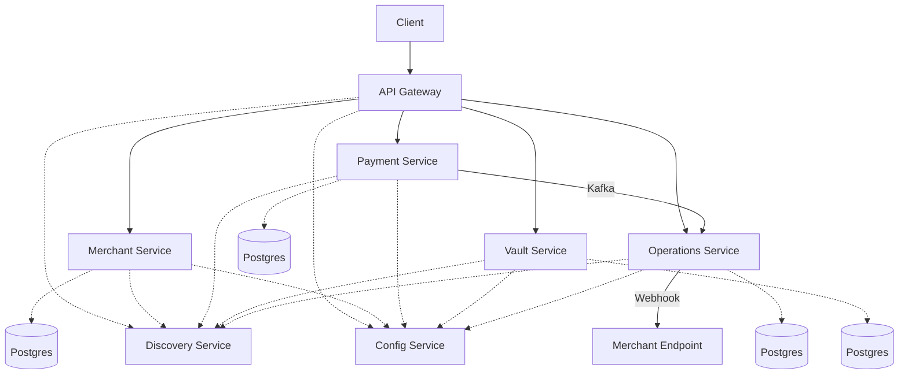

# Distributed Payment Gateway

A Razorpay-inspired payment gateway built as a distributed system of Spring Boot microservices, focused on core payment-processing concerns: authentication, idempotency, rate limiting, state machines, and event-driven settlement/webhook delivery.

## Architecture



All services register with Eureka (`discovery-service`) and pull configuration from a Spring Cloud Config server (`config-service`) backed by a separate [config repo](https://github.com/nexus-og-wb/distributed-razorpay-config).

## Services

| Service | Responsibility |
|---|---|
| `api-gateway-service` | Entry point. Routes requests, authenticates via JWT/API key, enforces per-key rate limits. |
| `merchant-service` | Merchant onboarding, auth (JWT), API key issuance, customers, webhook config. |
| `payment-service` | Orders, payments, refunds, payment state machine, outbox event publishing. |
| `vault-service` | Card tokenization and encrypted card data storage. |
| `operations-service` | Settlements, webhook delivery with retry/DLQ, consumes payment events from Kafka. |
| `config-service` | Centralized configuration via Spring Cloud Config Server. |
| `discovery-service` | Service registry (Eureka). |
| `common-lib` | Shared entities, enums, exceptions, rate limiters, idempotency store, API key cache. |

## Tech Stack

- Java 25, Spring Boot 4.1, Spring Cloud
- PostgreSQL (per-service databases)
- Redis (API key cache, distributed rate limiting, idempotency store)
- Apache Kafka (payment/order/refund/settlement events, outbox relay)
- Spring Cloud Gateway, Eureka, Config Server
- JWT (`jjwt`) and API key (Basic auth + BCrypt) authentication

## Current Status

Actively under development. Implemented so far:

- Gateway-level JWT and API key authentication, with API key caching and key-rotation grace period
- Distributed rate limiting at the gateway (fixed window, sliding window via Lua, token bucket implementations in `common-lib`)
- Redis-backed idempotency for mutating requests
- Merchant onboarding, API key management, webhook configuration
- Order/payment lifecycle via an explicit payment state machine
- Transactional outbox pattern for publishing payment/settlement events to Kafka
- Card tokenization via the vault service
- Webhook delivery with retry queue and dead-letter handling
- Settlement processing with a simulated bank transfer step
- Payment gateway adapters (card, UPI, net banking) backed by a bank callback simulator, not real payment networks

Not yet implemented:

- Docker/Kubernetes deployment manifests (none exist in the repo yet; services currently run locally against local Postgres/Redis/Kafka)
- Circuit breakers / bulkheads for inter-service calls
- Automated end-to-end test coverage across services

## Running Locally

Each service is a standalone Maven project. Prerequisites: JDK 25, Maven, and local instances of PostgreSQL, Redis, and Kafka reachable at the hosts/ports defined in [distributed-razorpay-config](https://github.com/nexus-og-wb/distributed-razorpay-config).

Start order matters due to service discovery and config resolution:

```bash
# 1. Config server
cd config-service && ./mvnw spring-boot:run

# 2. Discovery server
cd discovery-service && ./mvnw spring-boot:run

# 3. Remaining services (any order)
cd merchant-service && ./mvnw spring-boot:run
cd payment-service && ./mvnw spring-boot:run
cd vault-service && ./mvnw spring-boot:run
cd operations-service && ./mvnw spring-boot:run
cd api-gateway-service && ./mvnw spring-boot:run
```

## Roadmap

- Dockerize services and add a docker-compose setup for local infra (Postgres, Redis, Kafka)
- Kubernetes manifests for deployment
- Circuit breaker / retry resilience for inter-service and downstream calls
- Broader automated test coverage
